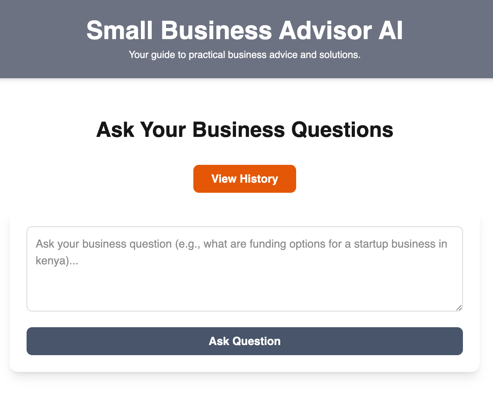
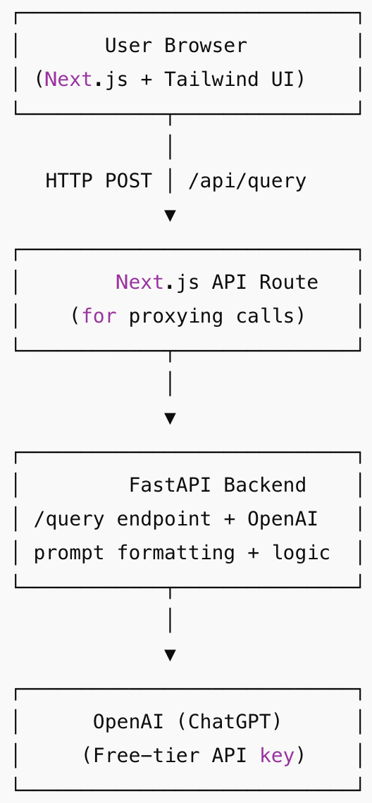

# 🌍 Small Business Advisor AI - Backend

This is the **FastAPI backend** for the Business Advisor AI project — an interactive Q&A system powered by a Language Learning Model (LLM), such as OpenAI's GPT. The API receives natural language questions about local or international business and returns well-structured, AI-generated answers.

---

## 📂 Preview



---

## 🚀 Tech Stack

**Backend (Python)**

- **Framework**: FastAPI (Python 3.8+)
- **LLM Integration**: OpenAI GPT (via `httpx`)
- **Async Client**: HTTPX
- **Environment Management**: python-dotenv
- **API Docs**: Swagger UI / ReDoc (auto-generated)
  **Frontend (JavaScript)**
- **Framework**: Next.js 15 (App Router)
- **UI**: Tailwind CSS

---

## 📂 Project Structure



## 🔧 Backend Setup Instructions

### 1. Clone the Repository

```bash
git clone https://github.com/your-username/ai-assistant.git
cd ai-assistant/backend
```

### 2. Create a Virtual Environment

```python -m venv venv
 source venv/bin/activate  # On Windows: venv\Scripts\activate
```

### 3. Install Dependencies

```
pip install -r requirements.txt
```

### 4. Set Up Environment Variables

Copy the example file and update with your actual OpenAI key:

```
cp .env.example .env
```

Edit .env and insert your API key:

```
OPENAI_API_KEY=sk-your-openai-key-here
```

### 5. Run the Development Server

```
uvicorn app.main:app --reload
```

By default, the API is available at:

- **Base URL**: http://localhost:8000/api/v1
- **Swagger Docs**: http://localhost:8000/docs
- **ReDoc**: http://localhost:8000/redoc

## API Endpoints

**GET /api/v1/**
Returns a welcome message.

**POST /api/v1/query**
Accepts a user's natural language business question and returns an AI-generated answer.

**GET /api/v1/history** Fetches the Q&A history. (The history is only kept in memory until the backend server is restarted)

**Request Example:**

```
{
  "question": "How do i start a business in the US?"
}
```

**Response Example:**

```
{
  "response": "Starting a business in the US can be an exciting venture. Here are the steps you can follow to get started:\n\n1. **Choose a Business Idea**: Identify a business idea that you are passionate about and that has potential in the Canadian market...."
}
```

**History Response Example:**

```
{
  "history": [
    {
			"question": "what are funding options for a startup business in kenya?",
			"response": "Securing funding for a startup in Kenya can be challenging, ...."
		}
  ]
}
```

## 🔧 Front Setup Instructions

### 1. Navigate to the Frontend Directory

```
Copy
Edit
cd ../frontend
```

### 2. Install Dependencies

```
Copy
Edit
npm install
# or
yarn
```

### 3. Run the Dev Server

```
Copy
Edit
npm run dev
# or
yarn dev
```

Frontend URL: http://localhost:3000

### 4. Environment Setup (optional)

Create a .env.local file for any frontend-specific environment variables if needed (e.g., base API URL).

## How It Works

User enters a business-related question via the UI.

Frontend sends the question to the FastAPI /api/v1/query endpoint.

Backend calls OpenAI with a business advisor prompt.

The formatted AI response is returned and displayed clearly in the UI.
